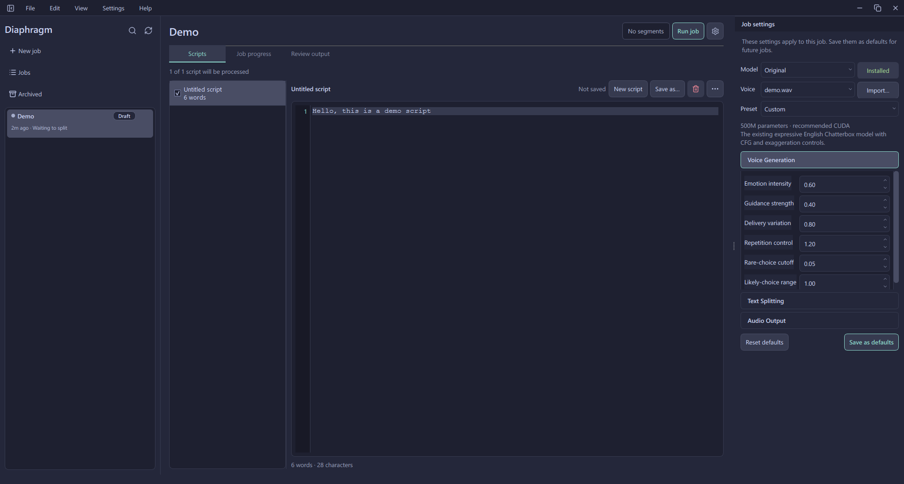

<div align="center">

<h1>Diaphragm</h1>

<p><strong>Local-first text-to-speech for long-form narration on Windows.</strong></p>

<p>
  <kbd>Windows</kbd>
  <kbd>Python 3.11</kbd>
  <kbd>Windows CI: configured</kbd>
  <kbd>Beta: v0.1.0-beta.1</kbd>
  <kbd>License: All Rights Reserved</kbd>
</p>

</div>



Diaphragm is a text-to-speech application designed for long-form scripts. It combines model and custom voice
selection, selective regeneration, and hardware-aware automatic text splitting
for a seamless generation workflow.

## Key features

- **Multiple TTS models** - Use Original, Turbo, Multilingual V3, or Nano.
- **Custom voices** - Import and select local voice references.
- **Hardware-aware generation** - Automatically size text sections using available VRAM and system memory.
- **Selective regeneration** - Edit and regenerate individual segments without recreating the entire output.
- **Integrated review** - Inspect progress, play audio, and examine individual segments inside the application.

## Getting started

Diaphragm currently requires 64-bit Windows and 64-bit Python 3.11. An internet
connection is required during initial runtime and model downloads. An NVIDIA GPU
is optional; supported systems can use CUDA, while other systems use CPU
generation.

### Download the Windows build

1. Open the [latest GitHub Release](https://github.com/Candymanmax/Diaphragm/releases) and download the Windows package.
2. Extract the complete archive to a folder.
3. Run `Diaphragm.exe`.
4. On first launch, allow Diaphragm to detect your hardware and install the appropriate PyTorch runtime.
5. Install or select a TTS model, then import a voice reference.
6. Create a job, add one or more `.txt` scripts, and select **Run job**.

### Run from source

The launcher creates an isolated runtime, selects the appropriate CPU or CUDA
dependencies, and installs missing packages.

```powershell
git clone https://github.com/Candymanmax/Diaphragm.git
cd Diaphragm
.\launch.bat
```

## Supported models

| Model | Language support | Native event tags | Intended use |
|---|---|---|---|
| Original | English | No | Expressive narration with full generation controls |
| Turbo | English | Yes | Faster generation with native event tags |
| Multilingual V3 | Multilingual | No | Narration in supported non-English languages |
| Nano | English | Yes | Lightweight generation for lower-spec hardware |

Supported event tags are `[clear throat]`, `[sigh]`, `[shush]`, `[cough]`,
`[groan]`, `[sniff]`, `[gasp]`, `[chuckle]`, and `[laugh]`.

## Privacy and local storage

Diaphragm keeps generation data on your computer. By default, scripts, voice
references, jobs, model data, logs, and generated audio are stored under
`%LOCALAPPDATA%\Diaphragm\` rather than inside the repository. Hugging Face
credentials are stored using Windows Credential Manager. Internet access is
needed for initial runtime and model downloads; generation runs locally after
setup.

## Beta limitations

Diaphragm is currently beta software.

- Only 64-bit Windows is currently supported.
- 64-bit Python 3.11 and an internet connection are required for first-time runtime setup.
- TTS models are downloaded separately and may require significant disk space.
- Larger models perform best with a compatible NVIDIA GPU; CPU generation is available but slower.
- Interfaces and configuration may change before version 1.0.

## Credits

- [Chatterbox](https://github.com/resemble-ai/chatterbox) - Text-to-speech models.
- [PyTorch](https://pytorch.org/) - Model inference and hardware acceleration.
- [PySide6](https://doc.qt.io/qtforpython-6/) - Desktop interface framework.
- [Catppuccin](https://catppuccin.com/) - Macchiato color palette.
- [Lucide](https://lucide.dev/) - Interface icons.

## License

Copyright © 2026 Diaphragm. All rights reserved. See [LICENSE](LICENSE) for
details.
